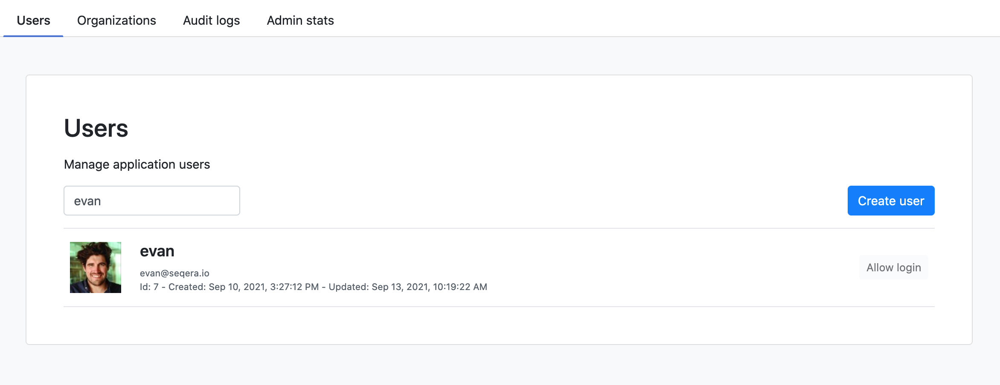
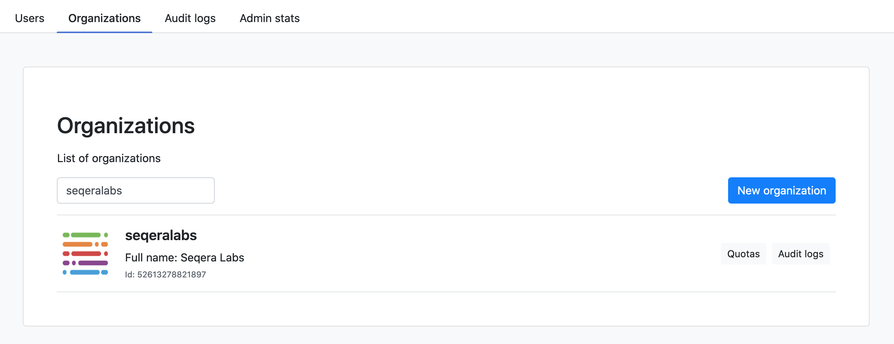
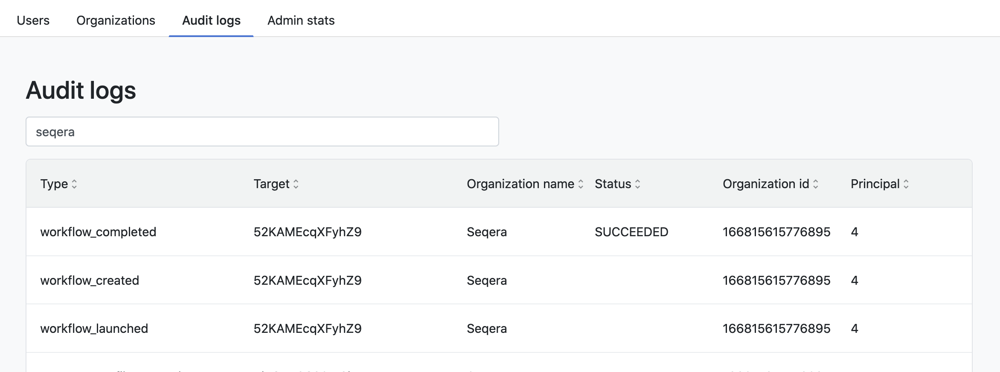

# Admin Panel

Nextflow Tower facilitates the global administration and auditing logs through the **Admin Panel**.

## Overview

### Users 

The **Users** tab is a global listing of all the users enrolled in the application. 

 

The following actions are available for the admins on **Users**

- Search functionality
- Delete a user from the Tower instance
- Edit a user profile 

### Organizations 

The **Organizations** tab is a global listing of all the organizations in the application. 

 

The following actions are available for the admins on **Organizations**

- Search functionality
- Edit an organization profile 

### Audit logs 

The **Audit logs** tab is a global log of all activity within Nextflow Tower application for audits.

 

The following actions are available for the admins 

- Search functionality

