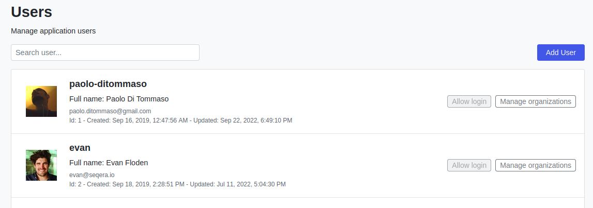
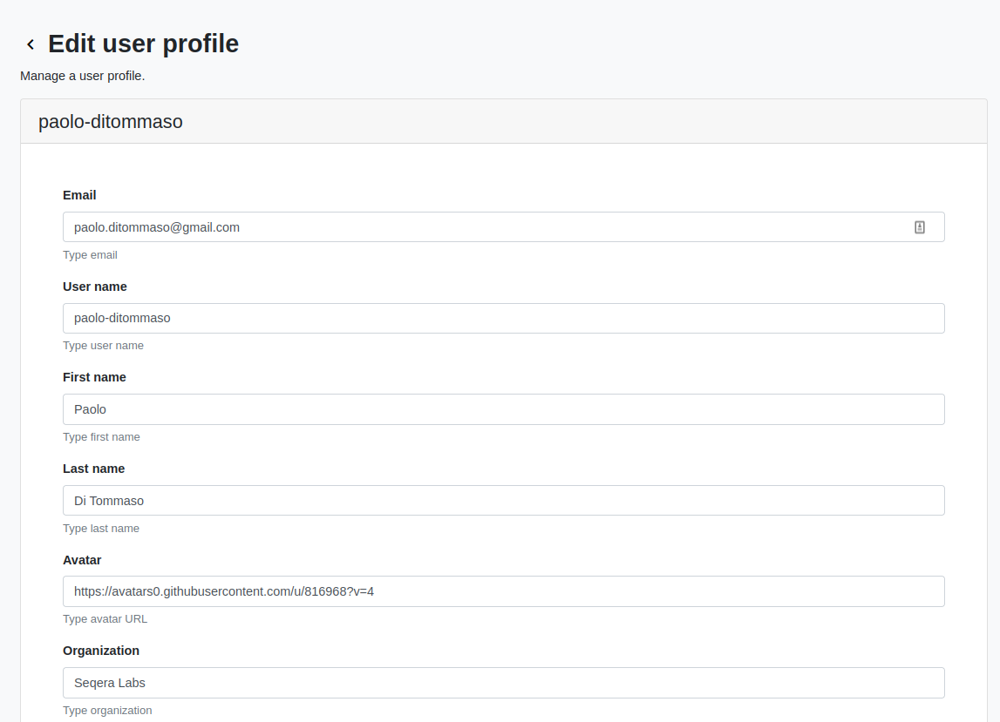
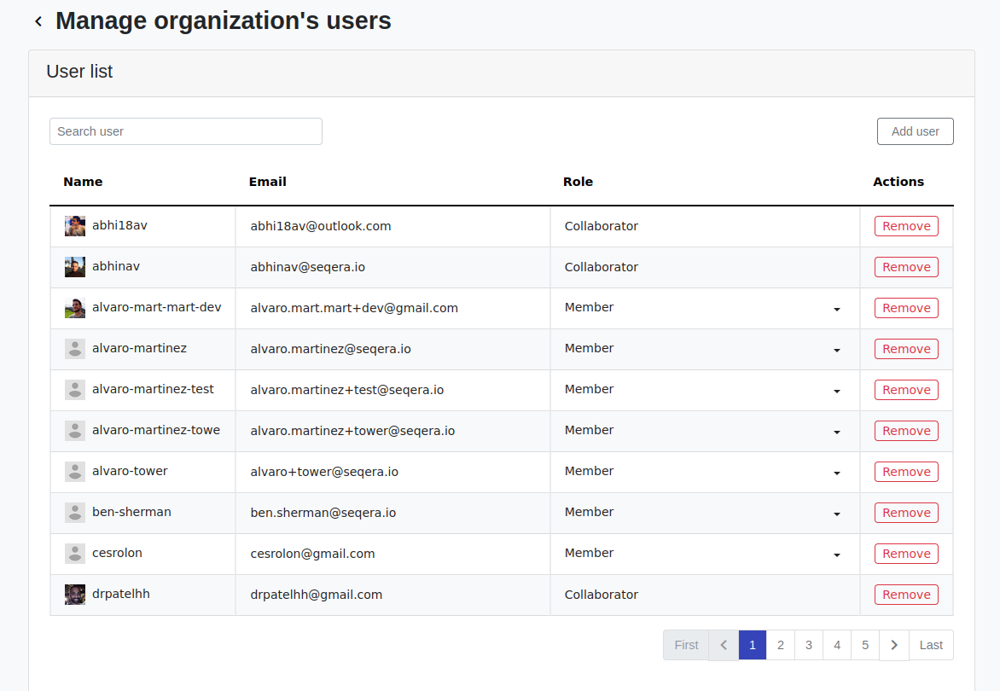
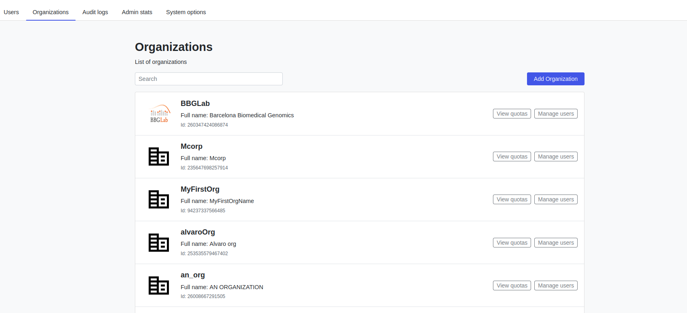
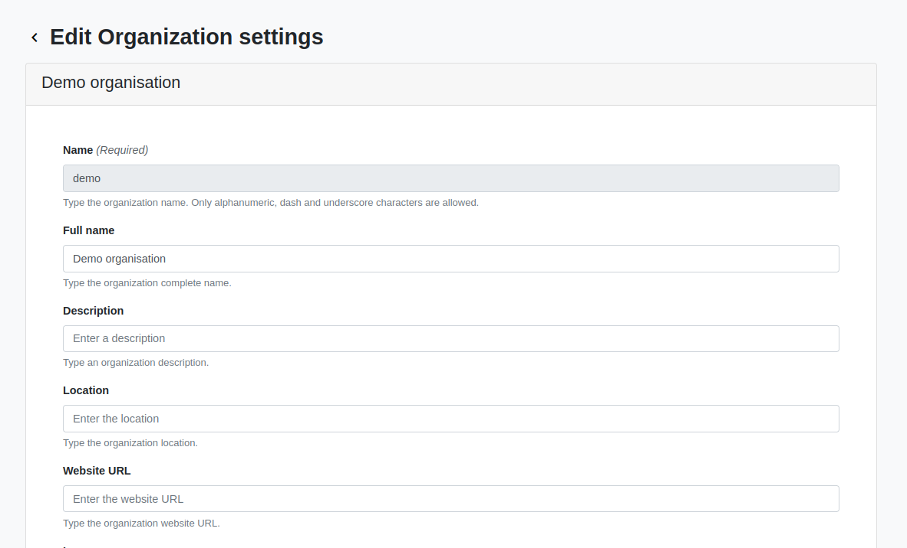

# Administration of Users, Organization and Memberships

As a **Root User** it is possible to have a comprehensive overview of the users and organizations present in the system through the **Admin Panel**.

The Admin Panel menu entry will be accessible, in the top right avatar menu, only if the current logged in user's email has been configured to be a Root user, a role that should be assigned to system administrator as it allows to perform several high level and potentially risky operations.

## Users Administration

The Users administration page lists all the users that are present in the Tower database. From this page it is possible to perform several operations:

### Search Users
The search user functionality allows to quickly find a specific user by its name or email and perform operation over it.

### Create a User
The Add User button on the top right corner above the table allows a Root User to create a new user from scratch. The new email should not be present in the system otherwise the user creation operation will not succeed: once the creation of the user has been completed is responsibility of the root user to inform the newly created user that access has been granted.

### Edit a User

By clicking on the username of one row of the user table is it possible to edit some of the details of the user and also perform a permanent deletion of the user.

### Membership Administration 

**Available from version 22.3.X **

From the user list it is also possible to have an overview to all the memberships for the selected user. The Membership administration page can be reached by clicking on the **Edit Organizations** button. From here it will be possible to list and search all the organization the user belongs to (as a member or as an owner), change the role of the user for that given membership, remove the user from the organization and add the user to a new organization. 

This last operation expects the organization to exist into the system and removal of a membership may fail if the user being removed is the last owner of that organization

## Organizations Administration

The Organization administration page lists all the organizations that are present in the Tower database. From this page it is possible to perform several operations:

### Search Organizations
The search organization functionality allows to quickly find a specific organization by its name or email and perform operation over it.

### Create Organization
The Create Organization button on the top right corner above the table allows a Root User to create a new organization from scratch.

### Edit Organization

By clicking on the organization name of one row of the organization table is it possible to edit some of the details of the organization and also perform deletion.

### Membership Administration 

**Available from version 22.3.X **

From the organizations list is it also possible to have an overview to all the memberships for the selected org. The Membership administration page can be reached by clicking on the **Manage User** button. From here it will be possible to list and search all the users that are member or owner of the selected organization, change the role of the user for that given membership, remove the member from the organization and add a new user to the current organization

This last operation expects the user to exist into the system and removal of a membership may fail if the user being removed is the last owner of the selected organization. To overcome this another user should be promoted to **Owner** before removing or demoting another owner
