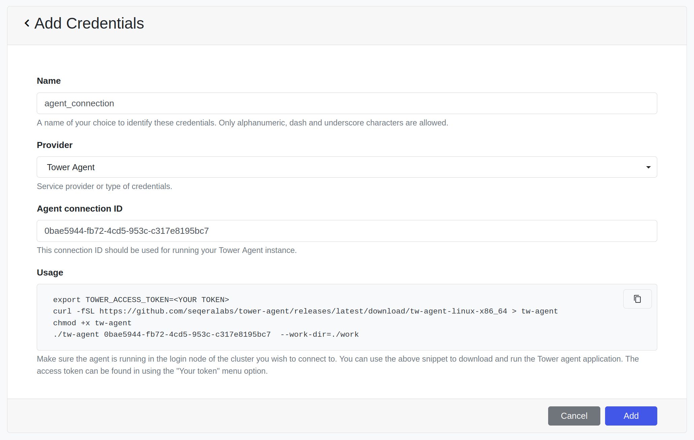
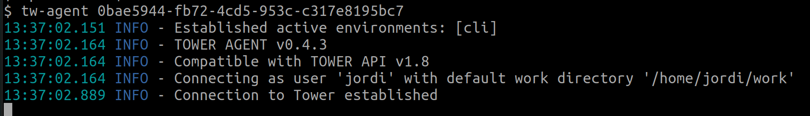

Tower Agent allows Tower to launch pipelines on HPC clusters that do not allow direct access through an SSH client.

Tower Agent is a standalone process that runs on a node that can submit jobs to the cluster (e.g. login node). It establishes an authenticated secure reverse connection with Tower, allowing Tower to submit and monitor new
jobs. The jobs are submitted on behalf of the user running the agent.


## Installation

Tower Agent it is distributed as a single executable file. You only need to download it and execute it.

1. Download the latest release from [Github](https://github.com/seqeralabs/tower-agent): 
    ```bash
    curl -fSL https://github.com/seqeralabs/tower-agent/releases/latest/download/tw-agent-linux-x86_64 > tw-agent
    ```

2. Make it executable:
    ```bash
    chmod +x ./tw-agent
    ```

3. (Optional) Move it into a folder that is in your path.


## Quickstart

Before running the Agent:

1. Create a **personal access token** in Tower. See [here](api/overview.md#authentication) for more instructions.

2. Create **Tower Agent** credentials in a Tower workspace. See [here](credentials/overview.md) for more instructions.

When you create the credentials you'll get an **Agent Connection ID**. You can use that ID or enter a custom ID, as long as you use the same connection ID in the workspace credentials and when you run the agent.



The agent should always be running in order to accept incoming requests from Tower. We recommend that you use a terminal multiplexer like [tmux](https://github.com/tmux/tmux) or [GNU Screen](https://www.gnu.org/software/screen/), so that it keeps running even if you close your SSH session.
```bash
export TOWER_ACCESS_TOKEN=<YOUR TOKEN>
./tw-agent <YOUR CONNECTION ID>
```




## Tips

- If you are using the agent with Tower Enterprise (on-prem) you can set the API url using the `TOWER_API_ENDPOINT` environment variable or the `--url` option.
- By default, the Agent uses the folder `${HOME}/work` as the Nextflow work directory. You can change it using the `--work-dir` option.
- The work directory **must** exist before running the agent.
- You can also change the work directory in Tower when you create a compute environment or launch a pipeline.


## Usage

```
Usage: tw-agent [OPTIONS] AGENT_CONNECTION_ID

Nextflow Tower Agent

Parameters:
*     AGENT_CONNECTION_ID    Agent connection ID to identify this agent.

Options:
* -t, --access-token=<token> Tower personal access token. If not provided TOWER_ACCESS_TOKEN variable will be used.
  -u, --url=<url>            Tower server API endpoint URL. If not provided TOWER_API_ENDPOINT variable will be used [default: https://api.tower.nf].
  -w, --work-dir=<workDir>   Default path where the pipeline scratch data is stored. It can be changed when launching a pipeline from Tower [default: ~/work].
  -h, --help                 Show this help message and exit.
  -V, --version              Print version information and exit.
```
