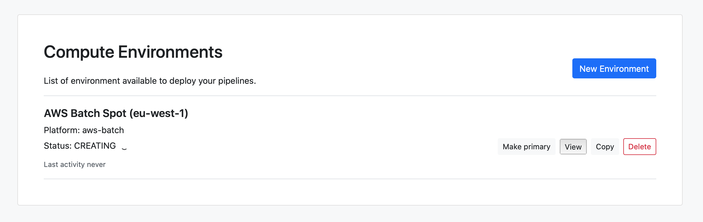

## Overview

!!! note "Requirements"
    This guide assumes you have an existing [Amazon Web Service (AWS) account](https://aws.amazon.com/). Sign up for a free AWS account [here](https://portal.aws.amazon.com/billing/signup).

There are two ways to create a **Compute Environment** for **AWS Batch** with Tower:

1. **Tower Forge**: This option automatically manages the AWS Batch resources in your AWS account.

2. **Manual**: This option allows you to create a compute environment using existing AWS Batch resources.

If you don't have an AWS Batch environment fully set-up yet, it is suggested to follow the [Tower Forge](#tower-forge) guide.

If you have been provided an AWS Batch queue from your account administrator, or if you have set up AWS Batch previously, please follow the [Manual](#manual) guide.

## Tower Forge

!!! warning
    Follow these instructions only if you have **not** pre-configured an AWS Batch environment. Note that this option will automatically create resources in your AWS account that you may be charged for by AWS.

Tower Forge automates the configuration of an [AWS Batch](https://aws.amazon.com/batch/) compute environment and the queues required for deploying Nextflow pipelines.

### IAM User

To use the Tower Forge feature, Tower requires an Identity and Access Management (IAM) user with the permissions listed in the following [policy file](../_templates/aws-batch/forge-policy.json). These authorizations are more permissive than those required to only launch a pipeline, since Tower needs to manage AWS resources on your behalf.

The steps below will guide you through the creation of a new IAM user for Tower, plus how to attach the required policy for the newly created user.

1. Open the [AWS IAM console](https://console.aws.amazon.com/iam).

2. Select **Users** in the left-hand menu and select **Add User** at the top.

3. Enter a name for your user (e.g. `tower`) and select the **Programmatic access** type.

4. Select **Next: Permissions**.

5. Select **Next: Tags**, then **Next: Review** and **Create User**.

    !!! warning "This user has no permissions"
        For the time being, you can ignore the warning. It will be addressed through our team using an **IAM Policy** later on.

6. Save the **Access key ID** and **Secret access key** in a secure location as we will use these in the next section.

7. Once you have saved the keys, select **Close**.

8. Back in the users table, select the newly created user and select **+ Add inline policy** to add user permissions.

9. Copy the content of the [policy linked above](../_templates/aws-batch/forge-policy.json){:target='_blank'} into the **JSON** tab.

10. Select **Review policy**, then name your policy (e.g. `tower-forge-policy`), and confirm the operation by selecting **Create policy**.

    !!! tip "Which permissions are required?"
        This policy includes the minimal permissions required to allow the user to submit jobs to AWS Batch, gather the container execution metadata, read CloudWatch logs and access data from the S3 bucket in your AWS account in read-only mode.

### S3 Bucket

S3 stands for "Simple Storage Service" and is a type of **object storage**. To access files and store the results for our pipelines, we have to create an **S3 Bucket** and grant our new Tower IAM user access to it.

1. Navigate to [S3 service](https://console.aws.amazon.com/s3/home).

2. Select **Create New Bucket**.

3. Enter a unique name for your Bucket and select a region.

    !!! warning "Which AWS region should I use?"
        The region of the bucket should be in the *same region as the compute environment that we create in the next section*. Typically users select a region closest to their physical location but Tower Forge supports creating resources in any available AWS region.

4. Select the default options for **Configure options**.

5. Select the default options for **Set permissions**.

6. Review and select **Create bucket**.

    !!! warning "S3 Storage Costs"
        S3 is used by Nextflow for the storage of intermediate files. For production pipelines, this can amount to a large quantity of data. To reduce costs, when configuring a bucket, users should consider using a retention policy, such as automatically deleting intermediate files after 30 days. For more information on this process, see [here](https://aws.amazon.com/premiumsupport/knowledge-center/s3-empty-bucket-lifecycle-rule/).

### Compute Environment

Tower Forge automates the configuration of an [AWS Batch](https://aws.amazon.com/batch/) compute environment and queues required for the deployment of Nextflow pipelines.

Once the AWS resources are set up, we can add a new **AWS Batch** environment in Tower. To create a new compute environment:

1. In a workspace, select **Compute Environments** and then **New Environment**.

2. Enter a descriptive name for this environment, e.g. "AWS Batch Spot (eu-west-1)"

3. Select **Amazon Batch** as the target platform.

    

4. From the **Credentials** drop-down, select existing AWS credentials, or add new credentials by selecting the **+** button. If you select to use existing credentials, skip to step 7.

5. Enter a name, e.g. "AWS Credentials".

6. Add the **Access key** and **Secret key**. These are the keys you saved previously when you created the AWS [IAM user](#iam-user).

    

    !!! tip "Multiple credentials"
        You can create multiple credentials in your Tower environment.

    !!! note "Container registry credentials"
        From version 22.3, Tower supports the use of credentials for container registry services. These credentials can be created from the [Credentials](../credentials/overview.md/#container-registry-credentials) tab.     

7. Select a **Region**, for example "eu-west-1 - Europe (Ireland)".

8. Enter the S3 bucket path created in the previous section to the **Pipeline work directory** field, e.g. `s3://unique-tower-bucket`.

    !!! warning
        The bucket should be in the same **Region** from the previous step.

9. Select **Enable Wave containers** to facilitate access to private container repositories and provision containers in your pipelines using the Wave containers service. See [Wave containers](https://seqera.io/wave/) for more information. 

10. Select **Enable Fusion v2** to allow access to your S3-hosted data via the Fusion v2 virtual distributed file system. This speeds up most data operations. The Fusion v2 file system requires Wave containers to be enabled (see above). See [Fusion file system](https://seqera.io/fusion/) for more information. 

11. Select **Enable fast instance storage** to allow the use of NVMe instance storage to speed up I/O and disk access operations. NVMe instance storage requires Fusion v2 to be enabled (see above).  

    !!! note Fast instance storage requires an EC2 instance type that uses NVMe disks. Tower validates any instance types you specify (from **Advanced options > Instance types**) during compute environment creation. If you do not specify an instance type, a standard EC2 instance with NVMe disks will be used (`'c5ad', 'c5d', 'c6id', 'i3', 'i4i', 'm5ad', 'm5d', 'm6id', 'r5ad', 'r5d', 'r6id'` EC2 instance families) for fast storage. 

12. Set the **Config mode** to **Batch Forge**.

13. Select a **Provisioning model**. In most cases this will be **Spot**.

    !!! tip "Spot or On-demand?"
        You can choose to create a compute environment that launches either **Spot** or **On-demand** instances. **Spot instances can cost as little as 20% of on-demand instances**, and with Nextflow's ability to automatically relaunch failed tasks, Spot is almost always the recommended provisioning model.

        Note, however, that when choosing Spot instances, Tower will also create a dedicated queue for running the main Nextflow job using a single on-demand instance in order to prevent any execution interruptions.

14. Enter the **Max CPUs** e.g. `64`. This is the maximum number of combined CPUs (the sum of all instances CPUs) AWS Batch will provision at any time.

15. Select **EBS Auto scale** to allow the EC2 virtual machines to dynamically expand the amount of available disk space during task execution.

    !!! warning "EBS autoscaling may cause unattached volumes on large clusters"
        When running large AWS Batch clusters (hundreds of compute nodes or more), EC2 API rate limits may cause the deletion of unattached EBS volumes to fail. Volumes that remain active after Nextflow jobs have completed will incur additional costs, and should be manually deleted. Monitor your AWS account for any orphaned EBS volumes via the EC2 console, or with a Lambda function. See [here](https://aws.amazon.com/blogs/mt/controlling-your-aws-costs-by-deleting-unused-amazon-ebs-volumes/) for more information.  

16. With the optional **Enable Fusion mounts** feature enabled, S3 buckets specified in **Pipeline work directory** and **Allowed S3 Buckets** will be mounted as file system volumes in the EC2 instances carrying out the Batch job execution. These buckets will be accessible at `/fusion/s3/<bucket-name>`. For example, if the bucket name is `s3://imputation-gp2`, the Nextflow pipeline will access it using the file system path `/fusion/s3/imputation-gp2`.

    !!! tip
        You are not required to modify your pipeline or files to take advantage of this feature. Nextflow is able to recognise these buckets automatically and will replace any reference to files prefixed with `s3://` with the corresponding Fusion mount paths.

17. Select **Enable GPUs** if you intend to run GPU-dependent workflows in the compute environment. See [GPU usage](./overview.md#aws-batch) for more information.  

18. Enter any additional **Allowed S3 buckets** that your workflows require to read input data or write output data. The **Pipeline work directory** bucket above is added by default to the list of **Allowed S3 buckets**.

19. To use **EFS**, you can either select **Use existing EFS file system** and specify an existing EFS instance, or select **Create new EFS file system** to create one. If you intend to use the EFS file system as your work directory, you will need to specify `<your_EFS_mount_path>/work` in the **Pipeline work directory** field (step 8 of this guide).

    - To use an existing EFS file system, enter the **EFS file system id** and **EFS mount path**. This is the path where the EFS volume is accessible to the compute environment. For simplicity, we advise that you use `/mnt/efs` as the EFS mount path.
    - To create a new EFS file system, enter the **EFS mount path**. We advise that you specify `/mnt/efs` as the EFS mount path.

20. To use **FSx for Lustre**, you can either select **Use existing FSx file system** and specify an existing FSx instance, or select **Create new FSx file system** to create one. If you intend to use the FSx file system as your work directory, you will need to specify `<your_FSx_mount_path>/work` in the **Pipeline work directory** field (step 8 of this guide). 

- To use an existing FSx file system, enter the **FSx DNS name** and **FSx mount path**. The FSx mount path is the path where the FSx volume is accessible to the compute environment. For simplicity, we advise that you use `/mnt/fsx` as the FSx mount path.
- To create a new FSx file system, enter the **FSx size** (in GB) and the **FSx mount path**. We advise that you specify `/mnt/fsx` as the FSx mount path.

21. Select **Dispose resources** if you want Tower to automatically delete these AWS resources if you delete the compute environment in Tower.

22. You can use the **Environment variables** option to specify custom environment variables for the Head job and/or Compute jobs.

23. Configure any advanced options described below, as needed.

24. Select **Create** to finalize the compute environment setup. It will take a few seconds for all the resources to be created, and then you will be ready to launch pipelines.

    

Jump to the documentation for [Launching Pipelines](../launch/launchpad.md).

#### Advanced options

- You can specify the **Allocation strategy** and indicate the preferred **Instance types** to AWS Batch.

- You can configure your custom networking setup using the **VPC**, **Subnets** and **Security groups** fields.

- You can specify a custom **AMI Id**.

    !!! warning "Requirements for custom AMI"
        To use a custom AMI, make sure the AMI is based on an Amazon Linux-2 ECS optimized image that meets the Batch requirements. To learn more about approved versions of the Amazon ECS optimized AMI, see [this AWS guide](https://docs.aws.amazon.com/batch/latest/userguide/compute_resource_AMIs.html#batch-ami-spec)

    !!! warning "GPU-enabled AMI"
        If a custom AMI is specified and the **Enable GPU** option is also selected, the custom AMI will be used instead of the AWS-recommended GPU-optimized AMI.

- If you need to debug the EC2 instance provisioned by AWS Batch, specify a **Key pair** to login to the instance via SSH.

- You can set **Min CPUs** to be greater than `0`, in which case some EC2 instances will remain active. An advantage of this is that pipeline executions will initialize faster.

    !!! warning "Increasing Min CPUs may increase AWS costs"
        Keeping EC2 instances running may result in additional costs. You will be billed for these running EC2 instances regardless of whether you are executing pipelines or not.

- You can use **Head Job CPUs** and **Head Job Memory** to specify the hardware resources allocated for the Head Job.

- You can use **Head Job role** and **Compute Job role** to grant fine-grained IAM permissions to the Head Job and Compute Jobs

- If you're using **Spot** instances, then you can also specify the **Cost percentage**, which is the maximum allowed price of a **Spot** instance as a percentage of the **On-Demand** price for that instance type. Spot instances will not be launched until the current spot price is below the specified cost percentage.

- You can use **AWS CLI tool path** to specify the location of the `aws` CLI.

## Manual

This section is for users with a pre-configured AWS environment. You will need a Batch queue, a Batch compute environment, an IAM user and an S3 bucket already set up.

To enable Tower within your existing AWS configuration, you need to have an IAM user with the following IAM permissions:

- `AmazonS3ReadOnlyAccess`
- `AmazonEC2ContainerRegistryReadOnly`
- `CloudWatchLogsReadOnlyAccess`
- A [custom policy](../_templates/aws-batch/launch-policy.json){:target='_blank'} to grant the ability to submit and control Batch jobs.
- Write access to any S3 bucket used by pipelines with the following [policy template](../_templates/aws-batch/s3-bucket-write-policy.json){:target='_blank'}. See [below for details](#access-to-s3-buckets)

With these permissions set, we can add a new **AWS Batch** compute environment in Tower.

### Access to S3 Buckets

Tower can use S3 to store intermediate and output data generated by pipelines. We need to create a policy for our Tower IAM user that grants access to specific buckets.

1. Go to the IAM User table in the [IAM service](https://console.aws.amazon.com/iam/home)

2. Select the IAM user.

3. Select **Add inline policy**.

4. Copy the contents of [this policy](../_templates/aws-batch/s3-bucket-write-policy.json){:target='_blank'} into the **JSON** tab. Replace `YOUR-BUCKET-NAME` (lines 10 and 21) with your bucket name.

5. Name your policy and select **Create policy**.

### Compute Environment

To create a new compute environment for AWS Batch (without Forge):

1. In a workspace, select **Compute Environments** and then **New Environment**.

2. Enter a descriptive name for this environment, e.g. "AWS Batch Manual (eu-west-1)".

3. Select **Amazon Batch** as the target platform.

    

4. Add new credentials by selecting the **+** button.

5. Enter a name for the credentials, e.g. "AWS Credentials".

6. Enter the **Access key** and **Secret key** for your IAM user.

    

    !!! tip "Multiple credentials"
        You can create multiple credentials in your Tower environment. See the [Credentials](../credentials/overview.md) section.

7. Select a **Region**, e.g. "eu-west-1 - Europe (Ireland)"

8. Enter an S3 bucket path for the **Pipeline work directory**, for example `s3://tower-bucket`

9. Set the **Config mode** to **Manual**.

10. Enter the **Head queue**, which is the name of the AWS Batch queue that the Nextflow driver job will run.

11. Enter the **Compute queue**, which is the name of the AWS Batch queue that tasks will be submitted to.

12. You can use the **Environment variables** option to specify custom environment variables for the Head job and/or Compute jobs.

13. Configure any advanced options described below, as needed.

14. Select **Create** to finalize the compute environment setup.

    

Jump to the documentation for [Launching Pipelines](../launch/launchpad.md).

#### Advanced options

- You can use **Head Job CPUs** and **Head Job Memory** to specify the hardware resources allocated for the Head Job.

- You can use **Head Job role** and **Compute Job role** to grant fine-grained IAM permissions to the Head Job and Compute Jobs

- You can use **AWS CLI tool path** to specify the location of the `aws` CLI.

- You can specify a custom **ECS agent configuration**. The content of this field is appended to the `/etc/ecs/ecs.config` file in each cluster node. Note that altering this file may result in a malfunctioning Tower Forge compute environment. See [here](https://docs.aws.amazon.com/AmazonECS/latest/developerguide/ecs-agent-config.html) for more information about the available parameters.
