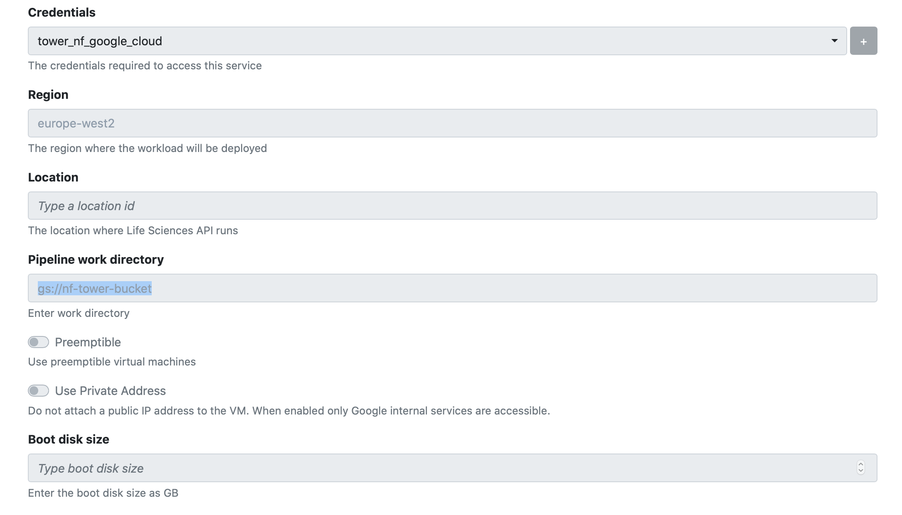

## Overview

!!! note "Requirements"
    This guide assumes you have an existing [Google Cloud Account](https://console.cloud.google.com). Sign-up for a free account [here](https://cloud.google.com/).

Tower provides integration to Google Cloud via the [Cloud Life Sciences API](https://cloud.google.com/life-sciences/docs/reference/rest).

The guide is split into two parts:

1. How to configure your Google Cloud account to use the Cloud Life Sciences API.

2. How to create a Google Life Sciences compute environment in Tower.

## Configure Google Cloud

### Create a project

Navigate to the [Google Project Selector page](https://console.cloud.google.com/projectselector2) and either select an existing project or select **Create project**.

Enter a name for your new project, e.g "tower-nf".

If you are part of an organization, the location will default to your organization.

### Enable billing

In the navigation menu (**≡**), select **Billing**. You can follow [these instructions](https://cloud.google.com/billing/docs/how-to/modify-project) to enable billing.

### Enable APIs

Use [this link](https://console.cloud.google.com/flows/enableapi?apiid=lifesciences.googleapis.com%2Ccompute.googleapis.com%2Cstorage-api.googleapis.com) to enable the following APIs for your project:

- Cloud Life Sciences API
- Compute Engine API
- Cloud Storage API

Select your project from the dropdown menu and select **Enable**.

Alternatively, you can enable each API manually by selecting your project in the nav bar and visiting each API page:

- [Cloud Life Sciences API](https://console.cloud.google.com/marketplace/product/google/lifesciences.googleapis.com)

- [Compute Engine API](https://console.cloud.google.com/marketplace/product/google/compute.googleapis.com)

- [Cloud Storage API](https://console.cloud.google.com/marketplace/product/google/storage-api.googleapis.com)

### Create service account key

1. In the navigation menu, select **IAM & Admin** and then **Service Accounts**.

2. Select the email address of the **Compute Engine default service account**.

3. Select **Keys**, then **Add key**, then **Create new key**.

4. Select **JSON** as the key type.

5. Select **Create**.

A JSON file will be downloaded to your computer. This file contains the credential that will be used by Tower. You will need it to configure the compute environment in Tower.

You can manage your key from the **Service Accounts** page.

### Create a Cloud Storage bucket

1. In the navigation menu (**≡**), select **Cloud Storage** and then **Create bucket**.

2. Enter a name for your bucket. You will reference this name when creating the compute environment in Tower.

    !!! warning
        Do not use underscores (`_`) in your bucket name. Use hyphens (`-`) instead.

3. Select **Region** for the **Location type** and select the **Location** for your bucket. You will reference this location when creating the compute environment in Tower.

4. Select **Standard** for the default storage class.

4. Select **Uniform** for the **Access control**.

    !!! note
        The Cloud Life Sciences API is available in a limited number of [locations](https://cloud.google.com/life-sciences/docs/concepts/locations). However, these locations are only used to store metadata about the pipeline operations. The storage bucket and compute resources can be in any region.

5. Select **Create**.

6. Once the bucket is created, you will be redirected to the **Bucket details** page.

7. Select **Permissions**, then **+ Add**.

8. Copy the email address of the Compute Engine default service account into **New principals**.

9. Select the following roles:

    - Storage Admin
    - Storage Legacy Bucket Owner
    - Storage Legacy Object Owner
    - Storage Object Creator

!!! tip "Congratulations!"
    You have created a project, enabled the necessary Google APIs, created a bucket and a JSON file containing required credentials. You are now ready to set up a new compute environment in Tower.

## Configure Tower

!!! warning "Requirements"
    The following guide to configure Tower assumes you have (1) a service account key for a Google Cloud account and (2) the name and location of a Cloud Storage bucket.

To create a new compute environment for Google Cloud in Tower:

1. In a workspace, select **Compute Environments** and then **New Environment**.

2. Enter a descriptive name for this environment, e.g. "Google Life Sciences (europe-west2)".

3. Select **Google Life Sciences** as the target platform.

    

4. Add new credentials by selecting the **+** button.

5. Enter a name for the credentials, e.g. "Google Cloud Credentials".

6. Enter the **Service account key** for your Google Cloud account. This key was created in the [previous section](#create-service-account-key).

    

7. Select the [**Region** and **Zones**](https://cloud.google.com/compute/docs/regions-zones#available) where you'd like to execute pipelines.

    

    You can leave the **Location** empty and the Cloud Life Sciences API will use the closest available location.

8. Enter your bucket URL for the **Pipeline work directory**. The URL is the name of your bucket with the `gs://` prefix, e.g. `gs://my-bucket`.

    This bucket should be accessible in the region selected in the previous step.

9. You can enable **Preemptible** to use preemptible instances, which have significantly reduced cost compared to on-demand instances.

10. You can use a **Filestore file system** to automatically mount a Google Filestore volume in your pipelines.

    

11. You can use the **Environment variables** option to specify custom environment variables for the Head job and/or Compute jobs.

12. Configure any advanced options described below, as needed.

13. Select **Create** to finalize the compute environment setup.

    

Jump to the documentation for [Launching Pipelines](../launch/launchpad.md).

#### Advanced options

- You can enable **Use Private Address** to ensure that your Google Cloud VMs aren't accessible to the public internet.

- You can use **Boot disk size** to control the boot disk size of VMs.

- You can use **Head Job CPUs** and **Head Job Memory** to specify the CPUs and memory allocated for head jobs.
