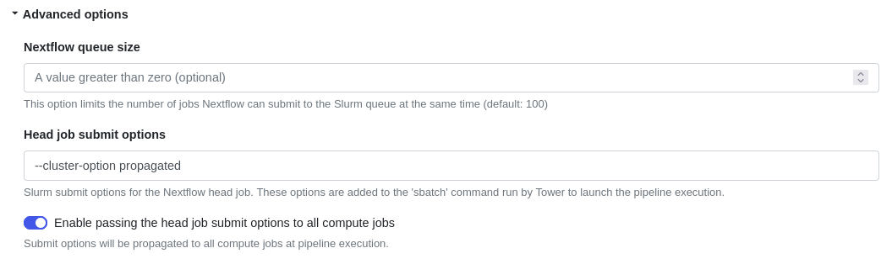

## Overview

[Slurm](https://slurm.schedmd.com/overview.html) is an open source, fault-tolerant, and highly scalable cluster management and job scheduling system for large and small Linux clusters.

Tower streamlines the deployment of Nextflow pipelines into both cloud-based and on-prem Slurm clusters.

## Requirements

To launch pipelines into a **Slurm** cluster from Tower, the following requirements must be satisfied:

* The cluster should be reachable via an SSH connection using an SSH key.
* The cluster should allow outbound connections to the Tower web service.
* The cluster queue used to run the Nextflow head job must be able to submit cluster jobs.
* The Nextflow runtime version **21.02.0-edge** (or later) should be installed on the cluster.

## Compute Environment

To create a new compute environment for **Slurm** in Tower:

1. In a workspace, select **Compute Environments** and then **New Environment**.

2. Enter a descriptive name for this environment, e.g. "Slurm cluster".

3. Select **Slurm Workload Manager** as the target platform.

4. Select your credentials, or select **+** and **SSH** to add new credentials.

5. Enter a name for the credentials.

6. Enter your **SSH private key** and associated **Passphrase** (if required), then select **Create**.

    !!! tip
        Your SSH key may not require a passphrase depending on how it was created. See [here](https://docs.github.com/en/free-pro-team@latest/github/authenticating-to-github/generating-a-new-ssh-key-and-adding-it-to-the-ssh-agent) for detailed instructions for how to create a key.

7. Enter the absolute path of the **Work directory** to be used on the cluster.

8. Enter the absolute path of the **Launch directory** to be used on the cluster. If omitted, it will be the same as the work directory.

9. Enter the **Login hostname**, which is usually the hostname or public IP address of the cluster's login node.

10. Enter the **Head queue name**, the cluster queue to which the Nextflow job will be submitted.

11. Enter the **Compute queue name**, the cluster queue to which the Nextflow job will submit tasks.

    !!! tip
        The compute queue can be overridden by the Nextflow pipeline configuration. See the Nextflow [docs](https://www.nextflow.io/docs/latest/process.html#queue) for more details.

12. You can use the **Environment variables** option to specify custom environment variables for the Head job and/or Compute jobs.

    

13. Configure any advanced options described below, as needed.

14. Select **Create** to finalize the creation of the compute environment.

Jump to the documentation for [Launching Pipelines](../launch/launchpad.md).

### Advanced options

- You can use the **Nextflow queue size** to limit the number of jobs that Nextflow can submit to the scheduler at the same time.

- You can use the **Head job submit options** to specify Slurm options for the head job.

- When setting up a compute env for HPC batch schedulers the user has the ability to specify the "Cluster options" to be applied to the head job running Nextflow as well as the child jobs executed during the pipeline.

