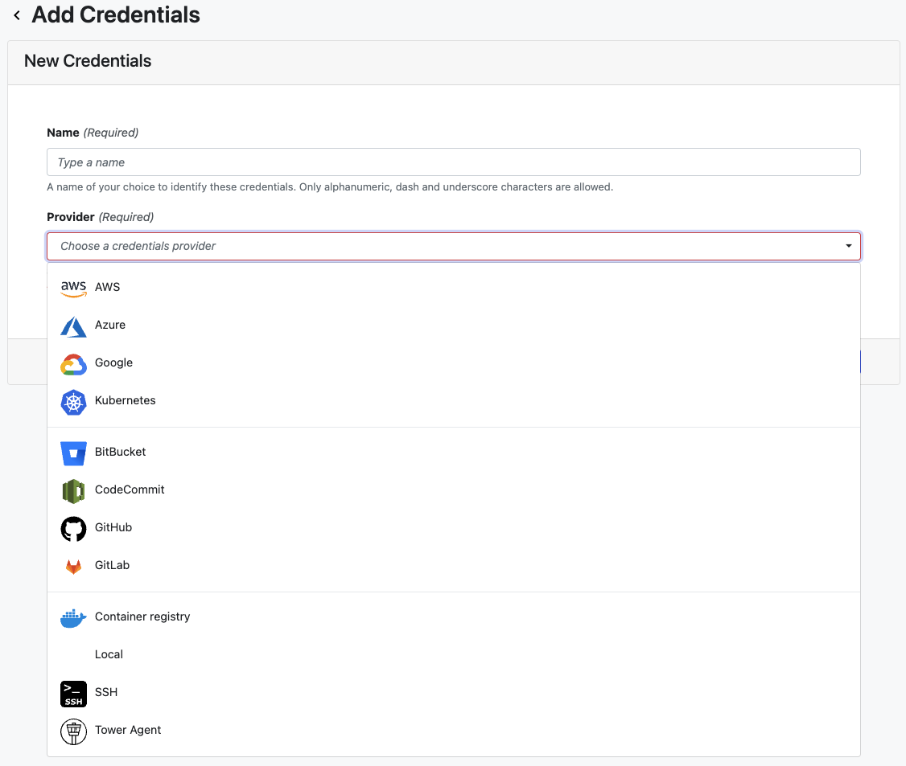

## Introduction

Tower uses the concept of **Credentials** to store the access keys and tokens for your [Compute Environments](../compute-envs/overview.md) and [Git hosting services](../git/overview.md). Detailed instructions for adding credentials can be found on the page for each compute environment and in the Git Integration section. 

!!! note 
    All credentials are encrypted using AES-256 before secure storage and never exposed by any Tower API.

