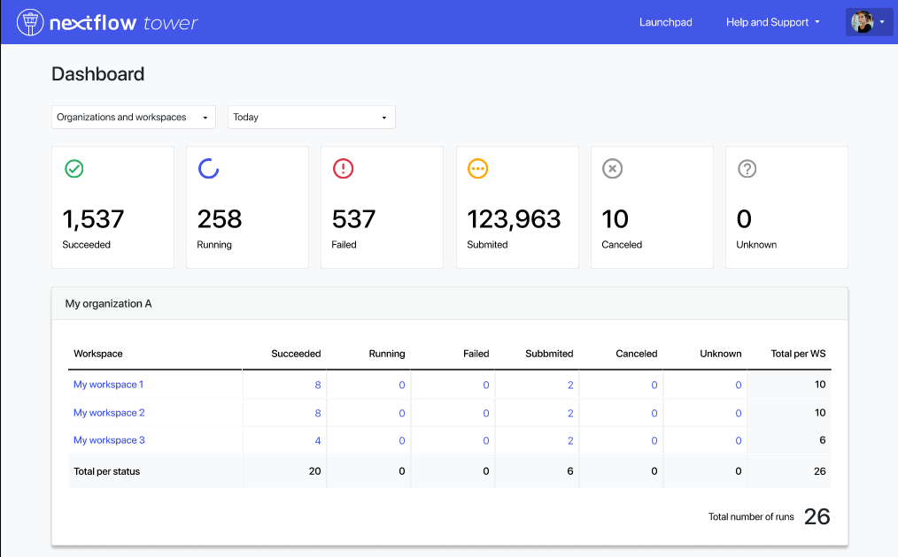

Since Tower v22.3.X we've added to Tower the **Dashboard** page, which helps you keep track of where all you accessible workflow executions have been submitted.

The page is split into two main areas:

 - At the top...
 - At the bottom...
