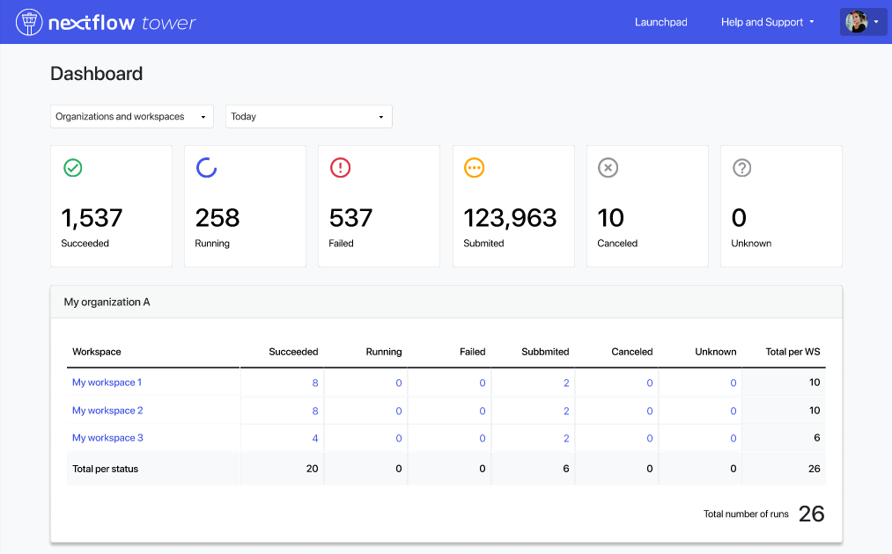
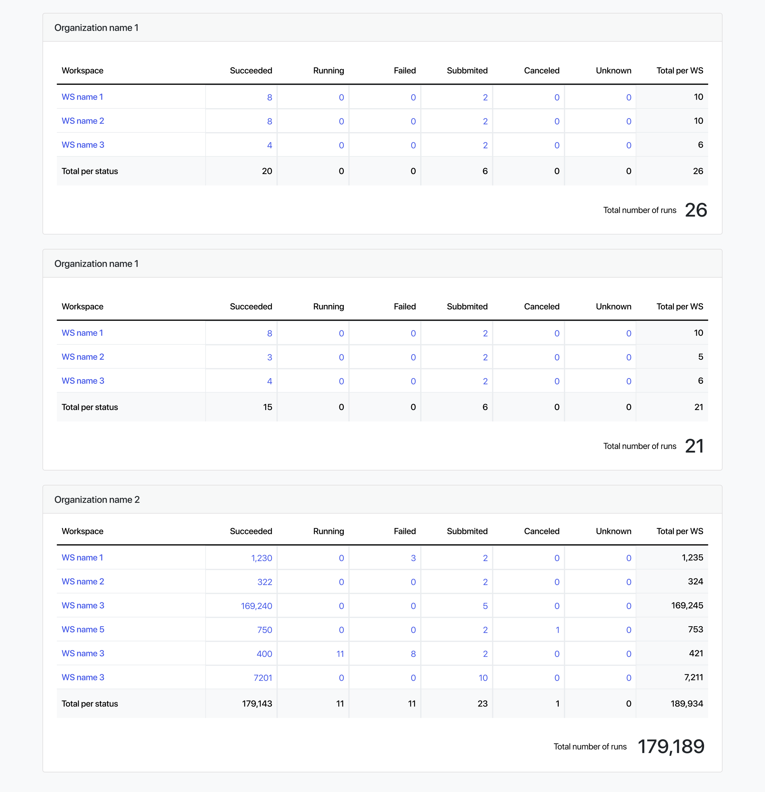

!!! note 
    This feature is available from Tower v.22.3X onwards.

## Overview

Since Tower v22.3.X we have added to Tower the **Dashboard** page, which helps you keep track of where all you accessible workflow executions have been submitted. You will be able to access it via your personal menu in the top right corner. Click your avatar and select "Dashboard".

The page is split into two main areas:

## Filters and summary

At the top, you can set up some filters that will strain the workflows you will be visualizing here. You can either see information regarding your personal workspace or across all organizations you have access to. You can also set up some time constraints.

Below these filters there is a section with a card per every possible workflow status, which yields a summary regarding the state of the total workflows.

## Workflows per organization

Below the filters, you will be able to see one card for every organization you have access to (or a single one with your "Personal Workspace" if you have selected this option in the filter above).

Every card consists of a row for every workspace you have access to inside this organizations, and at the same time a column for every possible workflow status, with a total column at the far right and a total row below.

There are various navigation options you can go from here if you want to investigate further on your workflows.

 - On the one hand, you can click on every workspace name to see the workflow runs in the context of that workspace.
 - On the other hand, you can click on any count number in any cell to see the workflow runs in the context of that workspace that are in that specific status (the filters there will be set for you automatically).

