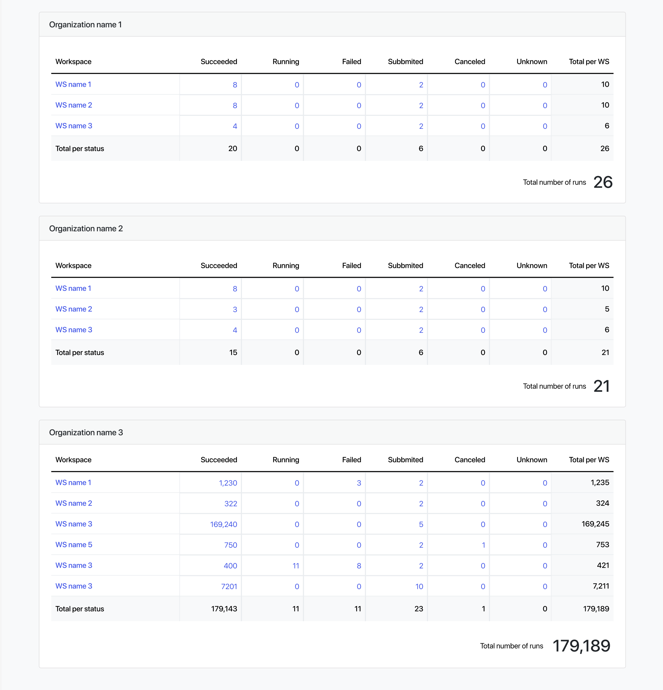

!!! note 
    This feature is available from Tower v.22.3.

## Overview

From version 22.3, Tower contains a **Dashboard** page that displays the details of workflow runs in your Workspace. The dashboard is accessed from the user menu in the top right corner. Click your avatar, then select "Dashboard".

The page is split into two main areas:

## Filters and summary

The drop-down lists at the top of the dashboard page allow you to filter the workflows displayed by personal Workspace, user Organizations, and time.

Below the filtering options, a summary of total workflows is displayed using cards for each workflow status.

## Workflow runs per organization

Below the cards displaying total workflow runs filtered by status, workflow run totals are filtered by each Organization, or your personal Workspace. Filtering depends on what you selected in the drop-down options near the top of the page. 

Every card consists of a row for every workspace you have access to inside this organizations, and at the same time a column for every possible workflow status, with a total column at the far right and a total row below.

There are various navigation options you can go from here if you want to investigate further on your workflows.

 - On the one hand, you can click on every workspace name to see the workflow runs in the context of that workspace.
 - On the other hand, you can click on any count number in any cell to see the workflow runs in the context of that workspace that are in that specific status (the filters there will be set for you automatically).

