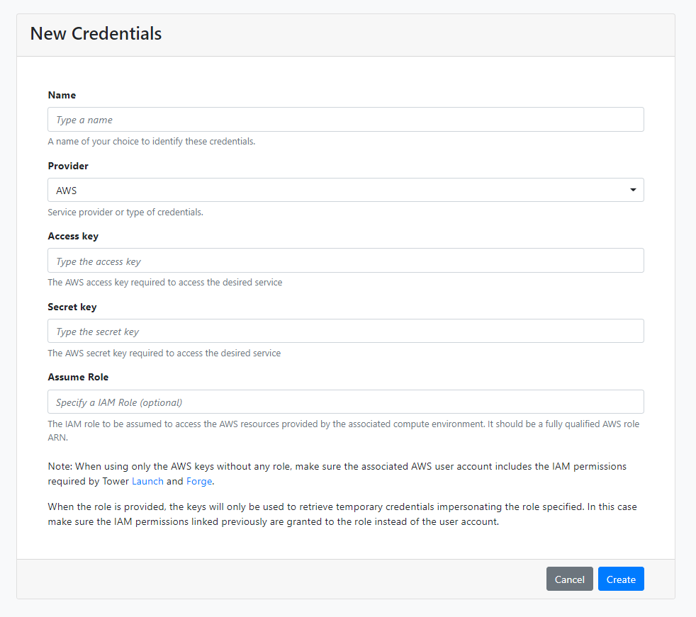
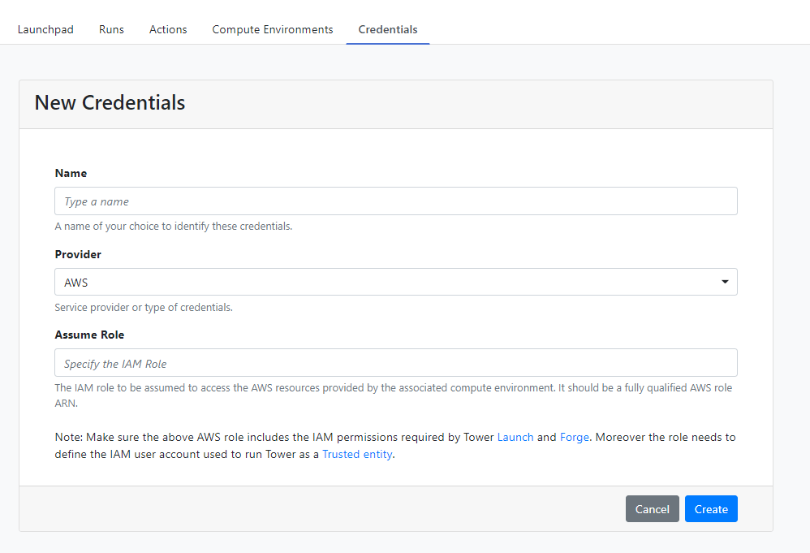

<!-- prettier-ignore-start -->
!!! note
    This feature requires Tower 21.06.0 or later.
<!-- prettier-ignore-end -->

AWS-based customers can configure Tower to interact with other AWS Services like Batch using an IAM Role rather than providing IAM User credentials.

## Configure the Tower IAM policy

<!-- prettier-ignore-start -->
!!! tip "Assumptions in Provided Policies"

    The provided policies were designed with certain assumptions:

    1. **IAM Policy**: Tower and Nextflow should have whole access to identified S3 Buckets.
    2. **Trust Policy**: The Role should be assumable by EC2, ECS, EKS, and only specifically-named IAM actors.

    You may wish to limit S3 access to specific prefixes, and/or Role assumption to more specific Platforms.
<!-- prettier-ignore-end -->

Create a custom IAM Policy ([Tower-Role-Policy.json](../_templates/Tower-Role-Policy.json)).

<!-- prettier-ignore-start -->
<details>
  <summary>Click to view custom Tower-Role-Policy.json</summary>
    ```json
     --8<-- "docs/_templates/Tower-Role-Policy.json"
    ```
<!-- prettier-ignore-end -->

</details>

1. Modify `BucketPolicy01` and `BucketPolicy02` with the name(s) of the your S3 Buckets.
2. Revise (if necessary) the scope of access to a specific prefix in the S3 bucket(s).

## Modify the Tower IAM Role Trust Policy (optional)

Review and modify the Role Trust Policy ([Tower-Role-Trust-Policy.json](../_templates/Tower-Role-Trust-Policy.json)).

<!-- prettier-ignore-start -->
<details>
  <summary>Click to view Tower-Role-Trust-Policy</summary>
    ```json
     --8<-- "docs/_templates/Tower-Role-Trust-Policy.json"
    ```
</details>
<!-- prettier-ignore-end -->

1. Replace `YOUR-AWS-ACCOUNT` with your own AWS Account Id.

2. Specify the Users and/or Roles able to assume the Tower IAM Role.


## Create the IAM artefacts

[Create the IAM Artefacts](https://docs.aws.amazon.com/IAM/latest/UserGuide/id_roles_create_for-service.html) in your AWS Account.

1. Navigate to the folder containing your configured IAM documents:

<!-- prettier-ignore-start -->
    ```bash
    cd <FOLDER_WITH_YOUR_CONFIGURED_IAM_DOCUMENTS>
    ```
<!-- prettier-ignore-end -->

2. Create the **Role**:

<!-- prettier-ignore-start -->
    ```bash
    aws iam create-role --role-name Tower-Role --assume-role-policy-document file://Tower-Role-Trust-Policy.json
    ```
<!-- prettier-ignore-end -->

2. Create an **inline policy** for the Role:

<!-- prettier-ignore-start -->
    ```bash
    aws iam put-role-policy --role-name Tower-Role --policy-name Tower-Role-Policy --policy-document file://Tower-Role-Policy.json
    ```
<!-- prettier-ignore-end -->

3. Create an **instance profile**:

<!-- prettier-ignore-start -->
    ```bash
    aws iam create-instance-profile --instance-profile-name Tower-Instance
    ```
<!-- prettier-ignore-end -->

4. **Bind** the Role to the instance profile:

<!-- prettier-ignore-start -->
    ```bash
    aws iam add-role-to-instance-profile --instance-profile-name Tower-Instance --role-name Tower-Role
    ```
<!-- prettier-ignore-end -->

## Configure Tower

With the IAM artefacts complete, update your Tower application configuration:

1. Add the following entry to your `tower.env`

<!-- prettier-ignore-start -->
    ```env
    TOWER_ALLOW_INSTANCE_CREDENTIALS=true
    ```
<!-- prettier-ignore-end -->

2. Restart the Tower application.

3. Verify that the change took effect by querying the Tower instance `service-info` endpoint:

<!-- prettier-ignore-start -->
    ```bash
    curl -X GET "https://YOUR-TOWER-DOMAIN/api/service-info" -H "Accept: application/json" | jq ".serviceInfo.allowInstanceCredentials"
    ```
<!-- prettier-ignore-end -->

3. Log in to Tower and create a new AWS credential. You are now prompted for an AWS `arn` instead of access keys.

    **Before Change**:
    

    **After Change**:
    
