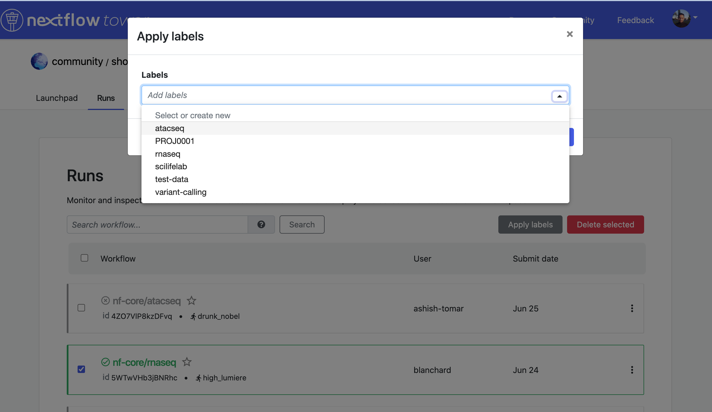
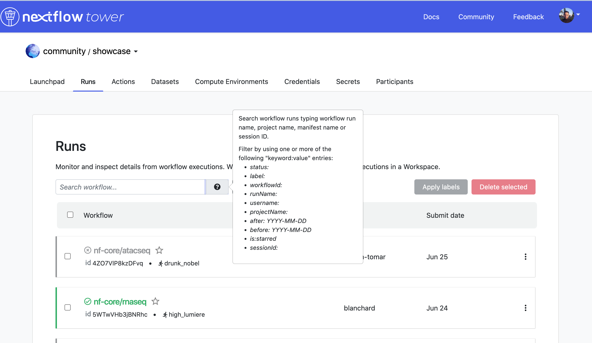

# Release notes for version 22.2.x

Nextflow Tower 22.2.x brings the following changes:

- Added support for Illumina DRAGEN
- Added support to mysql8
- Allow access remote pipelines via Tower Agent
- Feature 3025 reports download limit
- Adds used datasets tab to run details page
- Add support for redis password
- pipeline reports index page
- Feature 2663 / Labels
- Add support for AWS CodeCode repositories
- runName filled with random run name by default if not in relaunch mode
- Allow the ability to send cluster options from head queue to child nodes
- Add advanced search capabilities to runs page

## New features and usability improvements

We are pleased to announce the `22.2` release of Tower. This release brings a wealth of improvements to user-interaction and management of pipelines in a workspace at scale.

### Tower labels to organize runs

Tower now provides an answer to the users needs for categorization and retrieval with the introduction of Labels. Tower Labels are free text annotations that can be attached to Tower entities like pipelines, actions, or workflow runs either during or after creation.

Labels help organize the runs in a workspace, they facilitate project management by enabling categorization, search and retrieval of key content.

Detailed information can be found here https://help.tower.nf/22.2/labels/overview/

### Complex run filtering

Tower 22.2 enables easy run retrieval with complex queries. Together with the categorization allowed by labels, users can now filter runs with complex queries using a combination of free text with keyword:value filters, such as the run status or the launch date intervals.

### Tower Forge support for DRAGEN

We have extended the Tower Forge feature for AWS Batch to support DRAGEN. Tower Forge ensures that all of the appropriate components and settings are automatically provisioned when creating a Compute Environment for executing pipelines.

When deploying data analysis workflows, some tasks will need to use normal instance types (e.g. for non-DRAGEN processing of samples) and others will need to be executed on F1 instances. If the DRAGEN feature is enabled, Tower Forge will create an additional AWS Batch compute queue which only uses F1 instances, to which DRAGEN tasks will be dispatched

Full details are available [here](https://help.tower.nf/22.2/supported_software/dragen/overview/).

### Enhanced reports view

Available reports are listed in a Reports tab on the Runs page. Users can select a report from the table to open or download. See more detail [here](https://help.tower.nf/22.2/reports/overview/).

## Notes

1. As of version 22.1.x, Nextflow Tower Enterprise will follow a three month release cadence, using the following version number scheme: `YY.Q.PATCH`, where `YY` represents the year, `Q` represents the quarter and `PATCH` the incremental patch number.

2. As of version 21.02.x, a license key must be provided to enable the Tower deployment feature. The license key should be specified using the configuration variable `TOWER_LICENSE`. If you don't have a license key, contact sales@seqera.io.

## Warnings

1.  This version requires all database connections to use the following configuration value: `TOWER_DB_DRIVER=org.mariadb.jdbc.Driver`.
    Please update your configuration if you are upgrading. All other database configuration values should remain unchanged.

2.  This version expects the use of HTTPS by default for all browser client connections.
    If your Tower installation requires the use of unsecured HTTP, set the following environment variable in the infrastructure hosting the Tower application: `TOWER_ENABLE_UNSAFE_MODE=true`.

3.  If you are upgrading from a version of Tower prior to `21.04.x`, please update your implementation to `21.04.x` before installing this release.

## Database Schema

This Tower version requires a database schema update. Follow these steps to update your DB instance and the Tower installation.

1. Make a backup of the Tower database.

2. Download and update your container versions to:

   - `195996028523.dkr.ecr.eu-west-1.amazonaws.com/nf-tower-enterprise/backend:v22.2.1`
   - `195996028523.dkr.ecr.eu-west-1.amazonaws.com/nf-tower-enterprise/frontend:v22.2.1`

3. Redeploy the Tower application:

   - **docker-compose**:

     1. Restart the application with `docker-compose restart`. This will automatically migrate the database schema.

   - **kubernetes**:

     1. Update the cron service with `kubectl apply -f tower-cron.yml`. This will automatically migrate the database schema.
     2. Update the frontend and backend services with `kubectl apply -f tower-srv.yml`.

   - **custom deployment**

     1. Run the `/migrate-db.sh` script provided in the `backend` container. This will migrate the database schema.
     2. Deploy Tower following your usual procedures.

## Nextflow Launcher Image

If you must host your container images on a private image registry:

1. Copy the the nf-launches image to your private registry:

   - `quay.io/seqeralabs/nf-launcher:j17-22.06.1-edge`

2. Update your `tower.env` with the following environment variable:

   - `TOWER_LAUNCH_CONTAINER=<FULL_PATH_TO_YOUR_PRIVATE_IMAGE>`

     !!! warning
     If using AWS Batch, you will need to [configure a custom job-definition](../advanced-topics/custom-launch-container.md) and populate the `TOWER_LAUNCH_CONTAINER` with the job-definition name instead.

### Compute environments

The Tower compute environments to be made available to users must be specified in the Tower configuration.

The following ids options are available:

- `awsbatch-platform`: AWS Batch cloud compute service
- `gls-platform`: Google LifeSciences cloud compute service
- `azbatch-platform`: Azure Batch cloud compute service
- `lsf-platform`: IBM LSF batch scheduler
- `slurm-platform`: Slurm batch scheduler
- `altair-platform`: Altair PBS Pro batch scheduler
- `univa-platform`: (Univa/Sun) GridEngine
- `moab-platform`: Adaptive Computing Moab batch scheduler
- `k8s-platform`: Kubernetes compute platform
- `eks-platform`: AWS EKS compute platform
- `gke-platform`: Google GKE compute platform

Choose one or more of these platform ids and specify them via the environment variable `TOWER_ENABLE_PLATFORMS`, separating them via a comma.

### Changelog

For a detailed list of all changes, please consult the Nextflow Tower [Changelog](./changelog.md).

## Questions/Feedback

Contact us at [support@seqera.io](mailto:support@seqera.io). 
