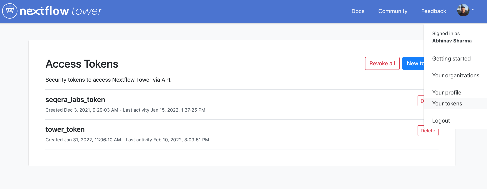
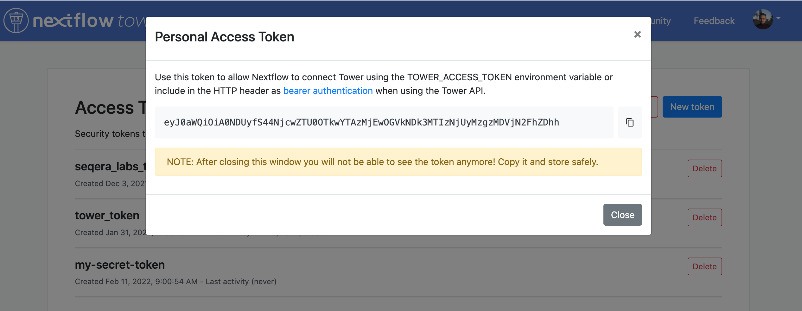

# Usage

You can use Tower through the web interface, the API, the CLI, or Nextflow itself using the `-with-tower` option.


## Tower web interface

1. Create an account and login into Tower, available free of charge, at [tower.nf](https://cloud.tower.nf).

2. Create and configure a new [compute environment](../compute-envs/overview.md).

3. Start [launching pipelines](../launch/launchpad.md).

## Tower API

To learn more about the Tower API, visit the [API](../api/overview.md) section in this documentation.

## Tower CLI

To learn more about the Tower CLI, visit the [CLI](../cli.md) section in this documentation.

## Nextflow `-with-tower`

1. Create an account and login into Tower.

2. Create a new token. You can access your tokens from the *Settings* drop-down menu:

    

3. Name your token.

    

4. Store your token securely.

    

5. Export your token.

6. Once your token has been created, open a terminal and enter the following commands:
    ```bash
    export TOWER_ACCESS_TOKEN=eyxxxxxxxxxxxxxxxQ1ZTE=
    export NXF_VER=20.10.0
    ```

    Where `eyxxxxxxxxxxxxxxxQ1ZTE=` is the token you just created.

    !!! note "Nextflow version"
        Bearer token support requires Nextflow version 20.10.0 or later, set with the second command above.

    To submit a pipeline to a [Workspace](./workspace.md) using Nextflow, add the workspace ID to your environment:
    ```bash
    export TOWER_WORKSPACE_ID=000000000000000
    ```

    The workspace ID can be found on the organisation's Workspaces overview page.

7. Run your Nextflow pipelines as usual with the `-with-tower` option:
    ```bash
    nextflow run hello.nf -with-tower
    ```

    You will be able to monitor your workflow runs in Tower!

    To configure and execute Nextflow pipelines in cloud environments, visit the [Compute Environments](../compute-envs/overview.md) section.

    !!! tip 
        See also the [Nextflow documentation](https://www.nextflow.io/docs/latest/config.html?highlight=tower#scope-tower) for further run configuration via Nextflow configuration files.
