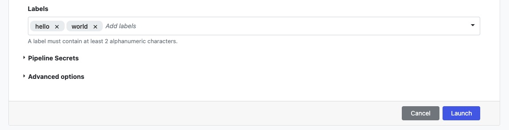

## Introduction

Tower now provides an answer to the  users needs to categorization and retrieval with the introduction of Labels. Tower Labels are free text annotations that can be attached to Tower entities like pipelines or workslod runs. 
Labels are useful to organize the work, manage production environment, and enable the categorization and retrieval of key information.

Labels can be associated with Tower elements like pipelines or runs at the moment of creation or afterwards. They are a flexible element  that lives in Tower and is not propagated to the underlying Nextflow pipeline.
Labels in Tower are a workspace-specific  feature, meaning each workspace as an independent set of labels than any other workspace. This also means that there is no such thing of organization level labels.

## How to create and assign labels
In the current implementation, users need to have at least maintainer role to create, assign and unassign labels to pipelines, actions and runs. 

Labels are assigned through a control that automatically suggest existing values as you type. You can also create a new label.

### Pipeline labels
Labels can be assigned to pipelines inside a Tower workspace both when a pipeline is originally created, and when a pipeline is edited via the interface.
Labels can be selected from the available list for the [workspace](#manage-labels), or created on the fly from the pipeline creation/edit forms.

Labels associated to a pipeline are, by default, propagated to all runs of such pipeline but users with enough permissions, can alter the set of labels associated with a workflow from the launch form. 
If the label set associated to a pipeline changes (e.g. by editing them), this change will not be reflected on past workflow runs for such pipeline. The change will affect only future runs using the pipeline.

Pipeline labels are displayed in the Launchpad page. Hover over the "+" icon to view all labels when they cannot be displayed due to the amount or length.

### Actions labels
Tower Labels can be assigned also to Actions at the moment of creation or editing by users with at least maintainer role. Here too, labels can be selected from the available list for the workspace or created on the fiy.

Exactly like pipelines, the labels associated to an Action will by default be applied to all workflow runs from action triggers. 

### Workflow labels###
Every workflow run executed inside a workspace can be labelled in Tower at any moment. Labels can be assigned to workflows via the **Labels** field in the launch form, as well as during or after execution from the Run Detail page.

Tower provides a filtering interface in the runs page in which users can freely select label combinations they want to apply to retrieve the relevant workflow  runs.
The filtering is complementary to the text box search, to further narrow the search results and save time to find the runs users are interested to.

## Manage labels

Labels can be viewed and managed from the Workspace settings page.
Users with at least maintainer role can edit the content of an existing label. This implies  updating the content association for the whole set of runs associated with the edited labels.
From this page, labels can also be removed from the workspace. Doing so implies deleting all the existing association with the label. All workflow runs that previously had the deleted label, will no longer be showing such association. This is an irreversible change.

## Limits

!!!warning
    Label names must contain a minimum of 1 and a maximum of 38 alphanumeric characters separated by dashes or underscores, and must be unique inside a Workspace

In addition to that, there are a few limits to be taken into account when using labels.

- A maximum amount of 25 labels can be created in a single workspace.

- A maximum amount of 25 labels can be attached to each individual resource.