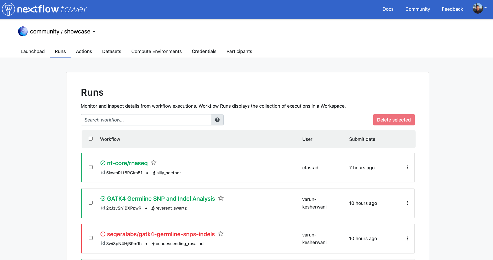

## Runs

Jobs that have been submitted with Tower can be monitored wherever you have an internet connection. 

The **Runs** tab contains all previous jobs executions. Each new or resumed job will be given a random name e.g: `grave_williams`.

The colors signify the completion status:

  - **Blue** are running.
  - **Green** are successfully executed.
  - **Yellow** are successfully executed where some tasks failed.
  - **Red** are jobs where at least one task fully failed.
  - **Grey** are jobs that where forced to stop during execution.

Selecting any particular run from the panel will display that run execution details.

## Search

Our integrated search covers all workflow runs inside a workspace, enabling easy retrieval of complex queries.
To search and filter the runs in a workspace, the user can write a search query in the "Search workflow" textbox.

The search text is interpreted by, identifying all substring formatted by `keyword:value` (This only applies to valid keywords shown below), combining all the rest in a single `Freetext` string, and then use all these search criteria to filter the runs.

An example of a complex search query is the following "`rnaseq username:john_doe status:succeded`".
This string will retrieve all runs from the workspace that:
- Ended successfully (`status:succeeded`) 
- **AND** have been launched by user john_doe (`username:john_doe`) 
- **AND** include "rnaseq" in the data fields covered by the free text search (e.g. the run name includes rnaseq)

The freetext search uses a **partial** match to find runs, meaning that it will search for "`*freetext*`" when looking for runs.
The `keyword:value` item, instead use **exact** match to filter runs, so  `username:john` will not retrieve runs launched by `john_doe`

!!! warning
    The implemented logic combines all filtering elements with **AND** logic. This means that queries like `status:succeeded, status:submitted` are formally valid but will return and empty list because a workflow can only have one status.

!!! warning
    The freetext resulting after identifying all the `keyword:value` are merged into a unique string including spaces, which may result in an empty list of results if there are typos.
### Search keywords

#### Free text
- The search box allows searching for workflows by partial match with `project name`, `run name`, `session id` or `manifest name`. Moreover, wildcards can be used to filter the desired workflows such as using asterisks `*` before and after keyword to filter results.

#### Exact match keywords
- `worlflowId:<id>`: search a workflow by its `id`.
   - E.g: `workflowId:3b7ToXeH9GvESr`
- `runName:<name>`: search with a specific `run name`.
   - E.g. `runName:happy_einstein`
- `sessionId:<id>`: search workflows with a specific `session id`.
   - E.g. `sessionId:85d35eae-21ea-4294-bc92-e35a60efa1a4` 
- `projectName:<name>`: search workflows with a specific `project name`.
   - E.g. `projectName:nextflow-io/hello`
- `userName:<name>`: search workflows by a specific `user name`.
    - E.g. `userName:john_doe`
- `status:<value>`: search workflows with a specific `status` (`submitted`, `running`, `succeeded`, `failed`, `cancelled`, `unknown`).
   - E.g. `status:succeeded` 
- `before:<date>`: search workflows submitted before the given date (`YYYY-MM-dd` format), this includes the specified date.
   - E.g. `before:2022-04-07` 
- `after:<date>`: search workflows submitted after the given date (`YYYY-MM-dd` format), this includes the specified date.
   - E.g. `after:2022-04-06`
- `label:<name>`: search workflows with a specific label (combine multiple label keywords in order to search workflows associated with all of those labels).
   - E.g. `label:my-label`

