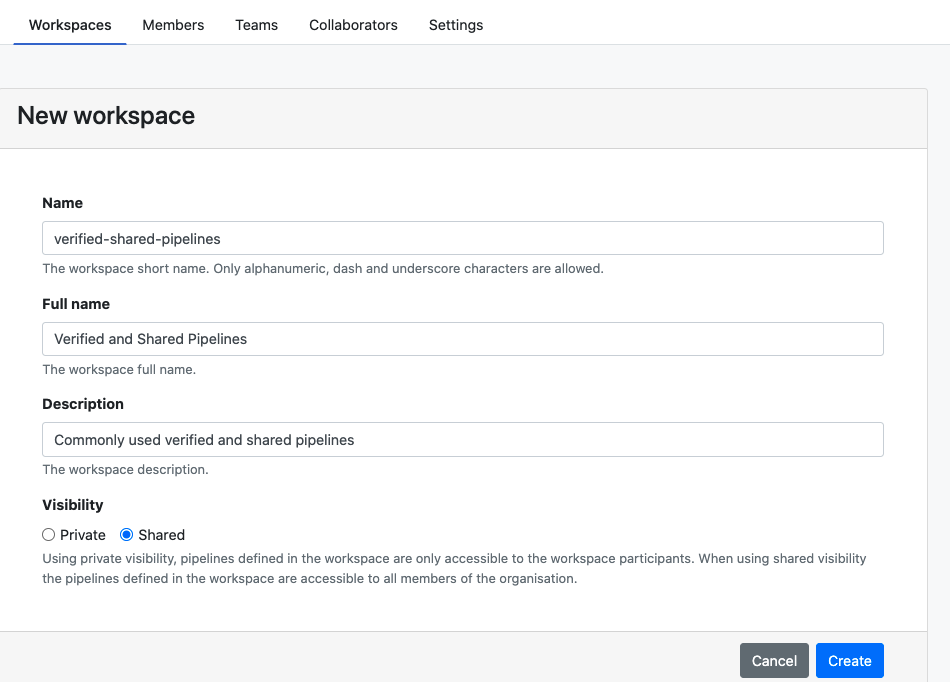
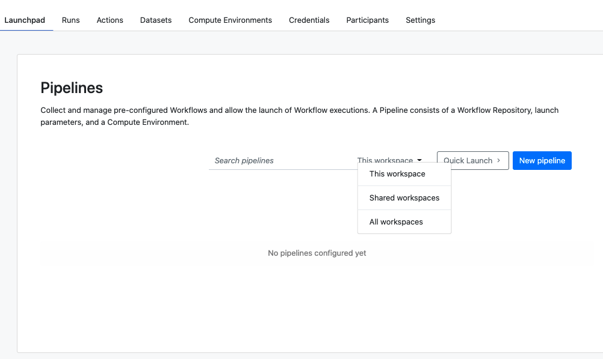

## Overview

We introduced the concept of shared workspaces as a solution for synchronization and resource sharing within an organization in Tower.

With a shared workspace, it is possible to create pipelines in a single place to be made accessible to all members of an organization.

The benefits that a shared workspace brings to an organization are:

-   **Define once and share everywhere**: Shared resources are set up once and automatically shared across the organization.

-   **Centralize the management of key resources**: Organization administrators can ensure that the correct pipeline configuration is used in all areas of an organization, without the need to replicate pipelines across multiple workspaces.

-   **Immediate update adoption**: Updated parameters for a shared pipeline are immediately available across the entire organization, reducing the risk of pipeline disparities.

-   **Computational resource provision**: Shared pipelines in shared workflows can be shared together with the needed computational resources. This avoids the need to duplicate resource setup in all individual workspaces across the organization. Shared workspaces can be used to centralize and simplify the resource sharing across an organization in Tower.

### How to create a shared workspace

Creating a shared workspace is similar to the creation of a private workspace, with the difference of _Visibility_ option, which is set to _Shared_.

### Creating a shared pipeline

To create a pipeline within a shared workspace, the choice of an associated compute environment is optional.

In case a compute environment from the shared workspace is associated with the pipeline, it will be available to users in other workspace who can launch that shared pipeline using it by default.

### Using shared pipelines from a private workspace

Once a pipeline is set up in a shared workspace and associated to a compute environment within the shared workspace, it is possible for any user to launch that pipeline from a private workspace using the shared workspace compute environment.

<!-- prettier-ignore -->
!!! note
    The shared compute environment would not be available to launch other pipelines which are only limited to that particular private workspace.

If a pipeline from a shared workspace is shared **without** an associated compute environment, users from other workspaces can run it using local workspaces. By default, the **primary** compute environment of the local workspace will be selected.

### Make shared pipelines visible in a private workspace

To make a shared pipeline visible from any shared workspace, you can use the visibility option on the Launchpad.

<!-- prettier-ignore -->
!!! note
    Currently, the pipelines from _all_ shared workspaces are visible when the visibility is set to "Shared workspaces".

