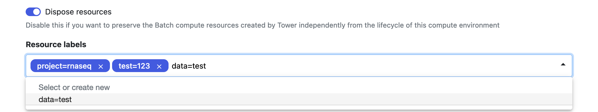
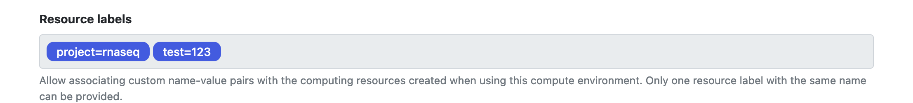
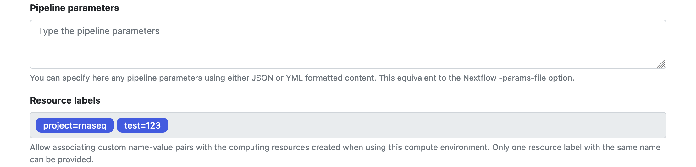

## Introduction

From version 22.3.X, Tower supports applying resource labels to compute environments and other Tower elements. This offers a flexible tagging system for annotation and tracking of the cloud services consumed by a run. 
Resource labels are sent to the service provider for each cloud compute environment in `key=value` format. 

Resource labels are applied to Tower elements during:
- compute environment creation with Forge
- submission
- and execution 

## Create and apply labels

Resource labels can be created, applied, and edited by a workspace admin or owner. When applying a label, users can select from existing labels or add new labels on the fly. 

### Resource labels applied to a compute environment

Admins can assign a set of resource labels when creating a compute environment.
All runs executed using the compute environment will be tagged with its resource labels.
Resource labels applied to a compute environment are displayed on the compute environment details page.

Apply a label when adding a new compute environment to the workspace.

!!!warning
    Once the compute environment has been created, its resource labels cannot be edited.

If a resource label is applied to a compute environment, all runs in that compute environment will inherit it. Likewise, all cloud resources generated during the workflow execution will be tagged with the same resource label.

### Resource labels applied to pipelines, actions, and runs

**Available from version 22.4.X**

Admins can override the default resource labels inherited from the compute environment when creating and editing pipelines, actions, and runs on the fly. The custom resource labels associated with each Tower element will propagate to the associated resources in the cloud environment without altering the default resource labels associated with the compute environment in Tower.

If a maintainer changes the compute environment associated with a pipeline or run, the resource labels field is updated with the resource labels from the new compute environment.

## Resource label propagation to cloud environments

Resource labels are only available for cloud environments that use a resource tagging system. 
Tower supports AWS, Google Life Sciences, Azure, and Kubernetes — HPC compute environments do not support resource labels. 

When a run is executed in a compute environment with associated resource labels, Tower propagates the labels to a set of resources (listed below), while Nextflow distributes the labels for the resources spawned at runtime.

If the compute environment is created through Forge, the compute environment will propagate the tags to the resources generated by the Forge execution.

!!!warning
    Resource label propagation is one-way and not synchronized with the cloud environment. This means that Tower attaches tags to cloud resources, but is not aware if those tags are changed or deleted directly in the cloud environment.

### AWS

When the compute environment is created with Forge, the following resources will be tagged using the labels associated with the compute environment:

**Forge creation time**

- FSX Filesystems (does not cascade to files)
- EFS Filesystems (does not cascade to files)
- Batch Compute Environment
- Batch Queue(s)
- ComputeResource
- Service Role
- Spot Fleet Role
- Execution Role
- Instance Profile Role

**Submission time**

- Jobs and Job Definitions
- Tasks (via the propagateTags paramater on Job Definitions)

**Execution time**

- Work Tasks (via the propagateTags paramater on Job Definitions)

At execution time, when the jobs are submitted to Batch, the requests are set up to propagate tags to all the instances created by the head job.

### Google Batch and Google Life Sciences

When the compute environment is created with Forge, the following resources will be tagged using the labels associated with the compute environment:

**Submission time**

- Job (Batch)
- RunPipeline (Life Sciences)

**Execution time**

- AllocationPolicy (Batch)
- VirtualMachine (Life Sciences)
- RunPipeline (Life Sciences)

### Azure

!!!note
    The labeling system on Azure Cloud uses the naming Metadata

When creating an Azure Compute Environment through Forge, resource labels are added to the Pool parameters: this will add a set of `key=value` metadata pairs to the Azure Batch Pool.

### Kubernetes

Both the Head pod and Work pod specs will contain the set of labels associated with the compute environment in addition to the standard labels applied by Tower and Nextflow.

!!!warning
    Currently, tagging with resource labels is not available for the files created during a workflow execution. The cloud instances are the elements being tagged.

The following resources will be tagged using the labels associated with the compute environment:

**Forge creation time**

- Deployment
- PodTemplate

**Submission time**

- Head Pod Metadata

**Execution time**

- Run Pod Metadata

## Search and filter with labels

Search and filter pipelines and runs using one or more resource labels. The resource label search uses a `label:key=value` format. 

## Overview of resource labels in a workspace

All resource labels used in a workspace can be viewed in the workspace’s Settings screen. 
Resource labels can only be edited or deleted by admins and only if they are not already associated with **any** Tower resource.
This includes both compute environments and runs.
The deletion of a resource label from a workspace has no influence on the cloud environment. 

## Limits

!!!note
    Currently, it is not possible to assign multiple resource labels, using the same key, to the same resource — regardless of whether this option is supported by the destination cloud provider.

Resource labels need to have a non-null key and value. Both the key and value have the same limitations as simple labels for composition and length.

- Resource labels can have a maximum of 25 characters.
- A maximum of 100 resource labels can be used in each workspace.  
