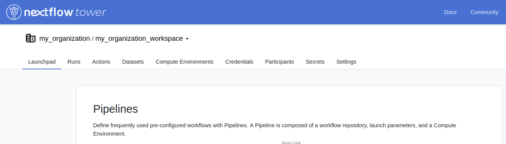
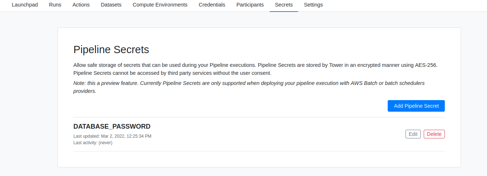
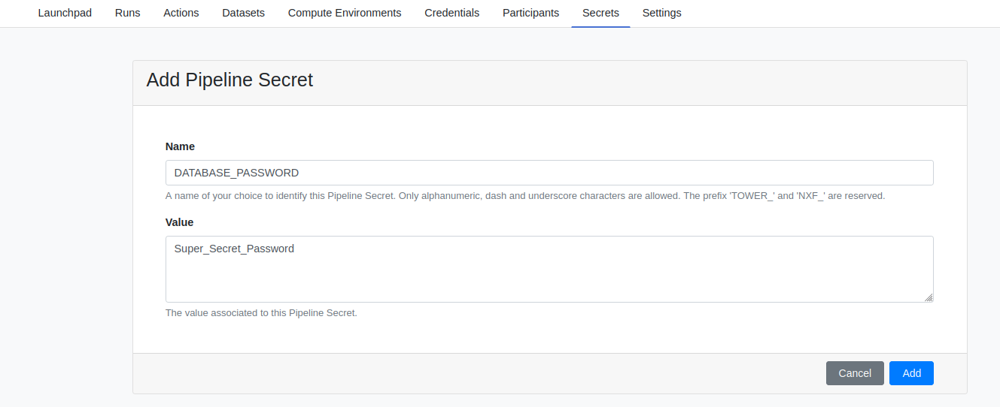
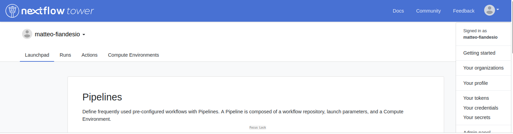

## Overview

Tower uses the concept of **Secrets** to store the keys and tokens used by workflow tasks to interact with external systems e.g. a password to connect to an external database or an API token. Tower relies on third-party secret manager services in order to maintain security between the workflow execution context and the secret container. This means that no secure data is transmitted from Tower to the Compute Environment.

<!-- prettier-ignore -->
!!! note 
    Currently only AWS Batch or HPC batch schedulers are supported. Please read more about the AWS Secret Manager [here](https://docs.aws.amazon.com/secretsmanager/index.html)

### Pipeline Secrets

To create a Pipeline Secret navigate to a Workspace (private or shared) and click on the **Secrets** tab in the top navigation pane to gain access to the Secrets management interface.



All of the available Secrets will be listed here and users with the appropriate permissions (maintainer, admin or owner) will be able to create or update Secret values.



The form for creating or updating a Secret is very similar to the one used for Credentials.



### Pipeline Secrets for users

Secrets can be defined for users by clicking on your avatar in the top right corner of the Tower interface and selecting "Your Secrets". Listing, creating and updating Secrets for users is the same as Secrets in a Workspace. However, Secrets defined by a user have a higher priority and will override any Secrets defined in a Workspace with the same name.



<!-- prettier-ignore -->
!!! warning
    Secrets defined by a user have higher priority and will override any Secrets defined in a Workspace with the same name.

### Using Secrets in workflows

When a new workflow is launched, all Secrets are sent to the corresponding secret manager for the Compute Environment. Nextflow will download these Secrets internally and use them when they are referenced in the pipeline code as described in the [Nextflow Secrets documentation](https://www.nextflow.io/docs/edge/secrets.html#process-secrets).

Secrets will be automatically deleted from the secret manager when the Pipeline completes (successful or unsuccessful).


## AWS Secrets Manager Integration

Tower and associated AWS Batch IAM Roles require additional IAM permissions to interact with AWS Secrets Manager:

### Tower Instance permissions
In addition to the [forge and/or launch policy](https://github.com/seqeralabs/nf-tower-aws), add the following Sid:

=== "IAM Permissions"
```json
{
    "Version": "2012-10-17",
    "Statement": [
        {
            "Sid": "AllowTowerEnterpriseSecrets",
            "Effect": "Allow",
            "Action": [
                "secretsmanager:DeleteSecret",
                "secretsmanager:ListSecrets",
                "secretsmanager:CreateSecret"
            ],
            "Resource": "*"
        }
    ]
}
```

### ECS Agent permissions
The ECS Agent uses the [Batch Execution role](https://docs.aws.amazon.com/batch/latest/userguide/execution-IAM-role.html#create-execution-role) to communicate with the AWS Secrets Manager.

1. Create an IAM Role with the following permissions and trust policy.
2. Provide the Role's as the AWS Batch Compute Environment's [**Batch execution role**](https://help.tower.nf/compute-envs/aws-batch/#advanced-options).

=== "IAM Permissions"
    1. Add the [`AmazonECSTaskExecutionRolePolicy` managed policy](https://docs.aws.amazon.com/aws-managed-policy/latest/reference/AmazonECSTaskExecutionRolePolicy.html).

    2. Add this inline policy (**TO DO: REPLACE POLICY AT SOURCE: (../_templates/aws-batch/secrets-policy-execution-role.json){:target='\_blank'} ):
    ```json
    {
        "Version": "2012-10-17",
        "Statement": [
            {
                "Sid": "AllowECSAgentToRetrieveSecrets",
                "Action": [
                    "secretsmanager:GetSecretValue"
                ],
                "Resource": [
                    "arn:aws:secretsmanager:<YOUR_COMPUTE_REGION>:*:secret:*"
                ],
                "Effect": "Allow"
            }
        ]
    }
    ```

=== "IAM Trust Relationship"
    ```json
    {
        "Version": "2012-10-17",
        "Statement": [
            {
                "Sid": "AllowECSTaskAssumption",
                "Effect": "Allow",
                "Principal": {
                    "Service": "ecs-tasks.amazonaws.com"
                },
                "Action": "sts:AssumeRole"
            }
        ]
    }
    ```

### Compute permissions
The Nextflow Head job must communicate with the AWS Secrets Manager. Its permissions come from either:

1. A custom role assigned during the [AWS Batch CE creation process](https://help.tower.nf/compute-envs/aws-batch/#advanced-options).
2. The host [EC2 instance role](https://docs.aws.amazon.com/batch/latest/userguide/instance_IAM_role.html). 


** TO DO - LINK BACK TO POLICY REPO:**

- [this custom policy](../_templates/aws-batch/secrets-policy-instance-role.json){:target='\_blank'} to the ECS Instance role associated with the Batch 
-  [this custom policy](../_templates/aws-batch/secrets-policy-account.json){:target='\_blank'} to your Tower IAM user (the one specified in the Tower credentials).

=== "EC2 Instance Role"
    1. Add the following policy to your EC2 Instance Role:
    ```json
    {
        "Version": "2012-10-17",
        "Statement": [
            {
                "Sid": "AllowNextflowHeadJobToAccessSecrets",
                "Effect": "Allow",
                "Action": "secretsmanager:ListSecrets",
                "Resource": "*"
            }
        ]
    }
    ```

=== "Custom IAM Role"
    1. Add the following policy to your custom IAM Role
    ```json
    {
        "Version": "2012-10-17",
        "Statement": [
            {
                "Sid": "AllowNextflowHeadJobToAccessSecrets",
                "Effect": "Allow",
                "Action": "secretsmanager:ListSecrets",
                "Resource": "*"
            },
            {
                "Sid": "AllowNextflowHeadJobToPassRoles",
                "Effect": "Allow",
                "Action": [
                    "iam:GetRole",
                    "iam:PassRole"
                ],
                "Resource": "arn:aws:iam::YOUR_ACCOUNT:role/YOUR_BATCH_CLUSTER-ExecutionRole"
            }
        ]
    }
    ```

    2. Add the following trust policy to your custom IAM role:
    ```json
    {
        "Version": "2012-10-17",
        "Statement": [
            {
                "Sid": "AllowECSTaskAssumption",
                "Effect": "Allow",
                "Principal": {
                    "Service": "ecs-tasks.amazonaws.com"
                },
                "Action": "sts:AssumeRole"
            }
        ]
    }
    ```